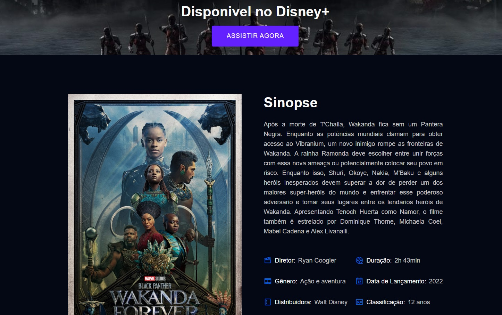
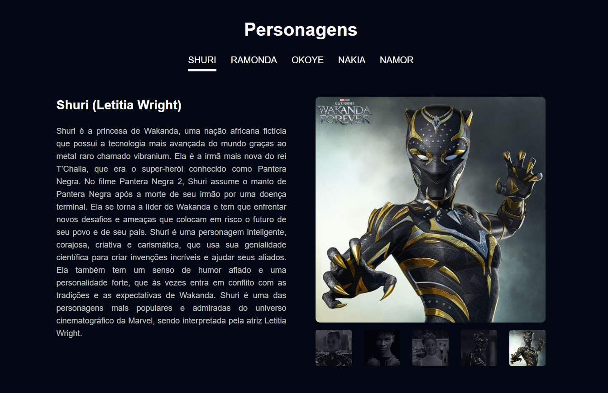

# 🏆 Landing Page Pantera Negra

 

 

## 📎 Sumario 

- 📌 Resumo do Projeto
- 🛠️ Como executar o projeto
- ⭐ Features
- 📂 Temas abordados
- ✔️ Tecnologias Utilizadas
- 🙋🏻‍♂️ Autor
- 💻 Licença

 

## 📌 Resumo do Projeto
Este projeto é uma landing page do filme pantera negra, que fornece informações sobre o filme, personagens, atores e curiosidades, trá uma seção com a sinopse e informações básicas do filme, uma seção de personagens onde o usuário pode selecionar o personagem individualmente e ainda visualizar uma galeria de imagens deste personagem, este projeto foi construido com Sass e JavaScript vanilla para gerenciamento de desenvolvimento, minificação e build do projeto foi utilizado o gulp.

 

## 🛠️ Como executar o projeto
Para executar este projeto localmente em sua máquina, siga estas etapas:

- Certifique-se de ter o Node.js instalado em sua máquina.

- Clone este repositório em sua máquina local usando o comando ``git clone``.

- Instale as dependências do projeto executando ``npm install`` no diretório do projeto.

- Para realizar a build do projeto, execute o comando ``npm run build``. Isso iniciará o comando ``gulp`` que executará as funções styles e images em paralelo para compilar os arquivos .scss em .css e otimizar as imagens.

- Para executar o projeto em modo de desenvolvimento, execute o comando ``npm run dev``. Isso iniciará o comando ``gulp watch`` que observará as alterações nos arquivos .scss e executará a função styles para compilar os arquivos .scss em .css.

- As funções dentro do arquivo ``gulpfile.js`` podem ser executadas individualmente com o comando ``gulp <nome-da-função>``, por exemplo, para executar apenas a função styles, execute o comando ``gulp styles``.

 

## ⭐ Features
- Banner inicial com link para página oficial do filme;
- Seção de sinopse com informações do filme;
- Seção de personagens com seleção individual dos personagens para mais informações;
- Galeria de fotos individual de cada personagem;
- Em desenvolvimento...

 

## 📂 Temas abordados
- Desenvolvimento responsivo: O projeto foi construído com o desenvolvimento responsivo em mente, garantindo que a interface do usuário se adapte a diferentes tamanhos de tela e dispositivos. Isso foi alcançado usando técnicas como media queries e unidades relativas para ajustar o layout e o tamanho dos elementos.

- SASS: O projeto usa SASS para estilização, aproveitando recursos como variáveis e mixins para manter o código limpo e modular. Isso permite uma fácil manutenção e atualização dos estilos, bem como a reutilização de código em diferentes partes do projeto.

- Gulp: O projeto utiliza a ferramenta gulp para minificação de código sass e javascript, comprimir imagens, gerenciar modo desenvolvimento e build do projeto, automatizando tarefas de compilação e melhorando a performance do projeto.

- JavaSctipt: O projeto utiliza o JavaScript para tornar a experiência do usuário e da página dinâmica, modificando elementos no decorrer da página de acordo com a interação do usuário.

 

## ✔️ Tecnologias Utilizadas

 

## 🙋🏻‍♂️ Autor

| [ Bruno Oliveira](https://github.com/BrunoOliveira16) |
| :---: |

 

## 💻 Licença
Este projeto está licenciado sob a licença MIT. Isso significa que você pode usar, copiar, modificar e distribuir o código-fonte deste projeto para qualquer finalidade, desde que inclua uma cópia da licença em todas as cópias ou partes substanciais do software.

Para obter mais informações sobre a licença MIT, consulte o <a href="https://opensource.org/license/mit/">texto completo da licença.</a>